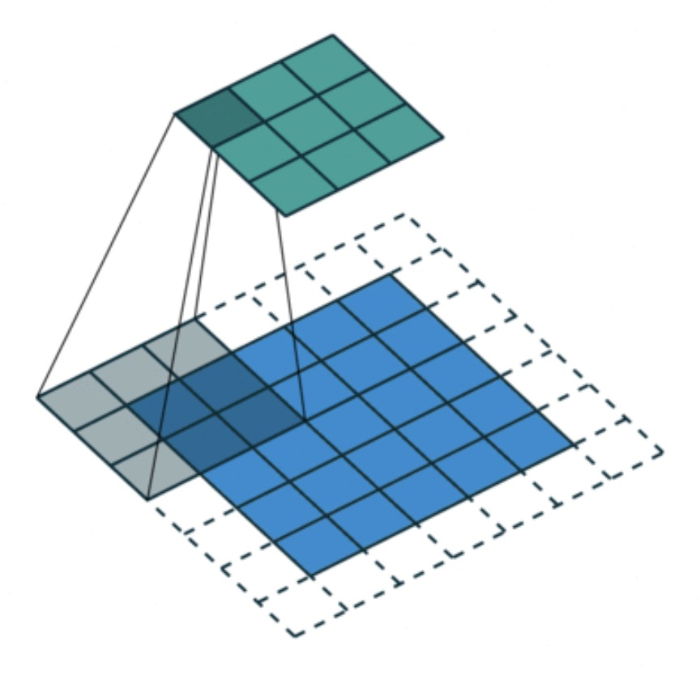
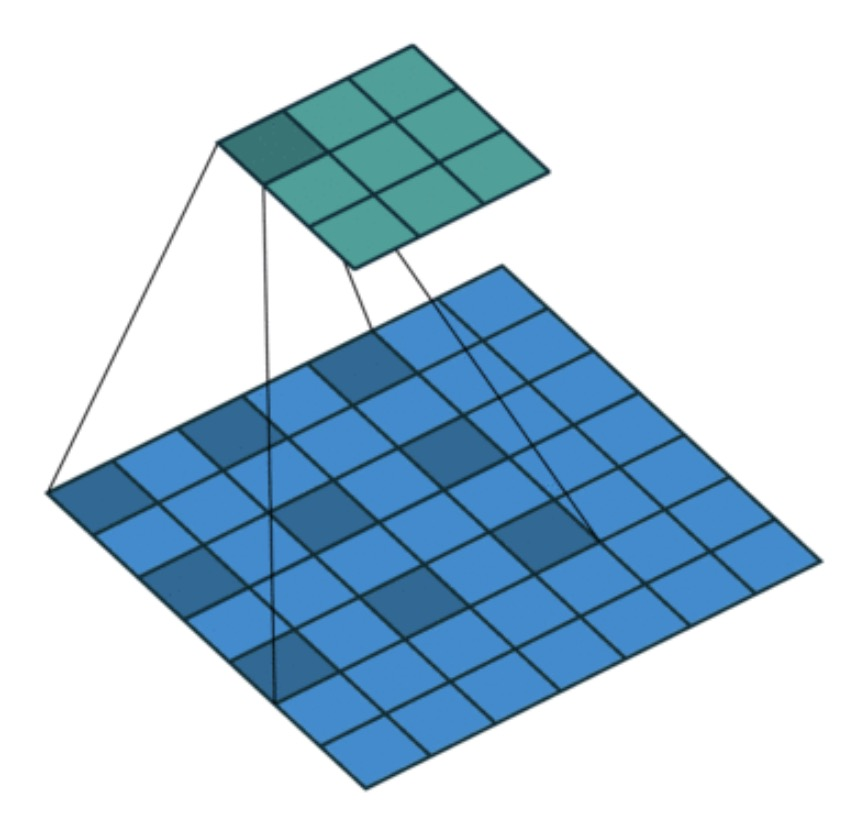
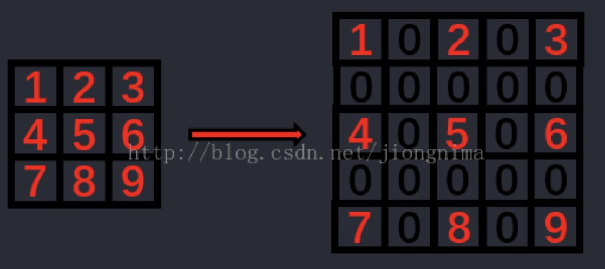
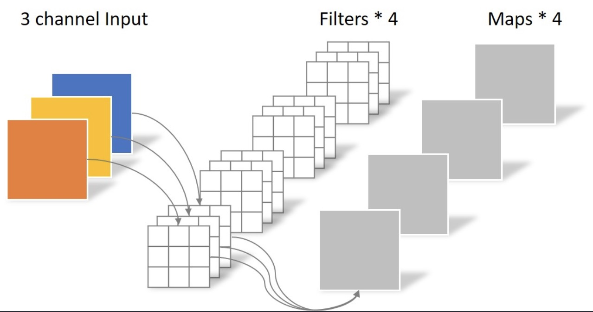
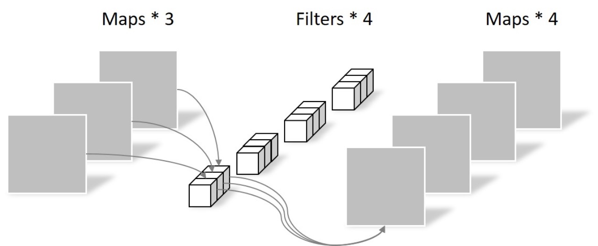
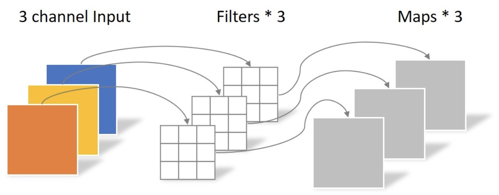
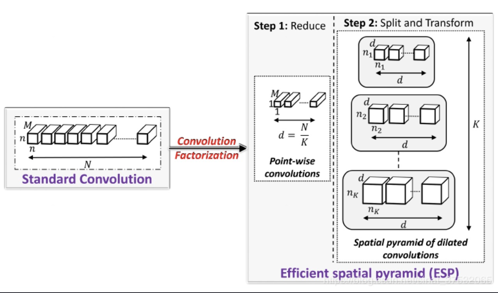

# ESPNet v2
## 前置知识：
### 一、（Dilated Convolution）空洞卷积、膨胀卷积
[卷积核膨胀（dilation）解析 - wangyuxi__的博客 - CSDN博客](https://blog.csdn.net/wangyuxi__/article/details/83003357)
#### 标准的卷积

Standard Convolution with a 3 x 3 kernel (and padding)
#### 空洞卷积

Dilated Convolution with a 3 x 3 kernel and dilation rate 2

空洞卷积就是在标准卷积中注入一些空洞来增大感受野而且不会增加参数量。
#### 卷积核膨胀系数的公式
膨胀的卷积核尺寸 = 膨胀系数 * (原始卷积核尺寸 - 1) + 1
### 二、（Depth-wise separable convolutions）深度可分离卷积(最早是Xception采用)
[卷积神经网络中的Separable Convolution](https://yinguobing.com/separable-convolution/)
思想是：**通道相关性**和**空间相关性**是可以分离的，第一步提取空间相关性，第二步提取通道相关性。将一个常规卷积分成两步走。这两部分是：(depth-wise convolutions)深度卷积（平面卷积，卷积核通道数为1）和(point-wise convolutions)逐点卷积（卷积核尺寸为1x1）
#### 简单复习：
（1）常规卷积：输入为**height**x**width**x**channel**的FeatureMap与**n**个**3**x**3**x**channel**的卷积核卷积后得到：**height**x**width**x**n**大小的图像。例如某个卷积核先在每一个通道上卷积然后将结果相加求和得到一个**height**x**width**x**1**的图像，n个卷积核就构成了**height**x**width**x**n**大小的图像。卷积核的权值共享一般只是在单通道内，不同通道卷积核的值应该不一样。所以卷积核总参数量为**3**x**3**x**n**x**channel**。

**如果把卷积核限定为1x1的大小，那么：**

（1）卷积核个数n小于channel时，可以降维
（2）增加非线性：1\*1卷积核，可以在保持feature map尺度不变的（即不损失分辨率）的前提下大幅增加非线性特性（利用后接的非线性激活函数），把网络做的很deep。
（3）通道变换：使用1x1卷积核，实现降维和升维的操作其实就是channel间信息的线性组合变化，3x3，64channels的卷积核后面添加一个1x1，28channels的卷积核，就变成了3x3，28channels的卷积核，原来的64个channels就可以理解为跨通道线性组合变成了28channels，这就是通道间的信息交互

（2）深度卷积（就是卷积核的通道数为1，只在平面进行，完全不管通道之间的相关性）：
#### 总结：Depth-wise separable convolutions就是先进行一个纯平面的卷积（没有利用到通道间的相关性，只利用了空间长宽的相关性），再进行一个常规卷积，只不过这里卷积核都是1x1的（学习了通道间的相关性）。通过计算可以发现将一个常规卷及操作分成两步后，计算的参数量大幅下降。

## ESP模块：
将标准卷积等效成三步：首先通过1x1conv对输入特征进行降维，然后使用多个不同膨胀率的卷积核对低维特征特征进行卷积，因为各个膨胀卷积核的感受野不同，而且从小到大都有，有点类似空间金字塔，所以作者将其命名为ESP模块。最后一步进行分层特征融合：就是将第二步得到的结果按一点规则拼接。

